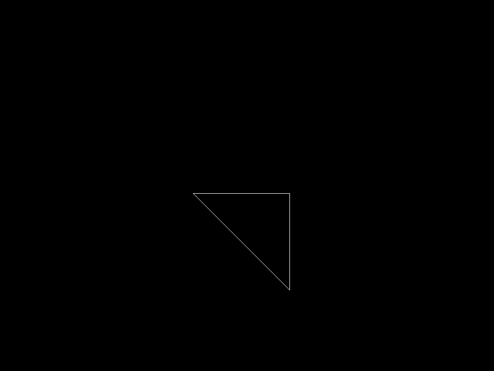
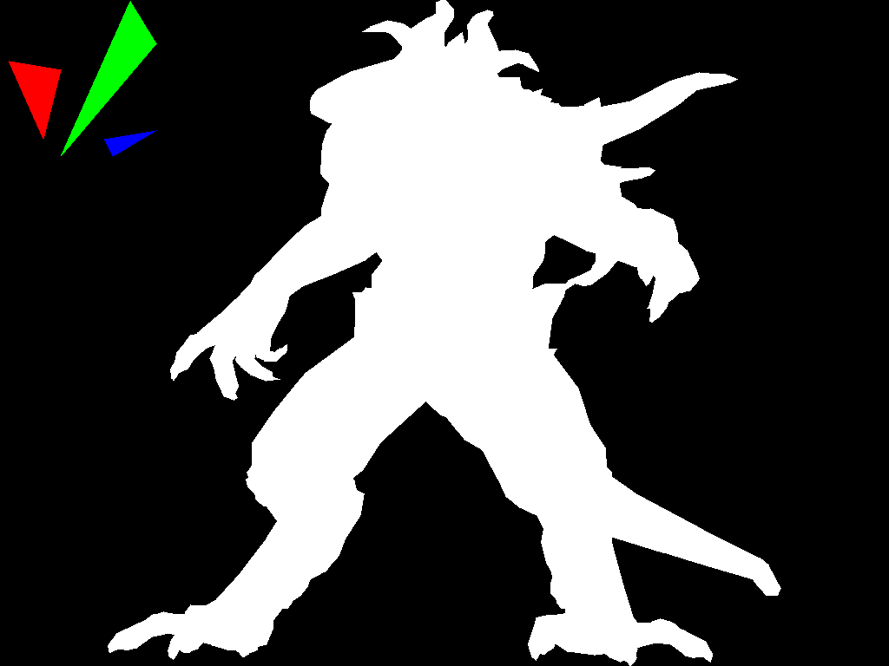

# RDV

Ceci est un projet de première année de Master Informatique lié à l'U.E. Représentation de Données visuelles (RDV).
Le projet proposé consiste à développer un petit moteur de rendu afin d'afficher un modèle 3D avec un filtre
permettant un effet anaglyphe. Ce programme n'utilise pas de librairies externes (OpenGL etc..), et il n'y a que
300 lignes de codes.

Lien vers les cours :
* https://github.com/ssloy/tinyrenderer/wiki
* https://github.com/ssloy/tinyraytracer/wiki

Dans ce readme, vous trouverez :
* Les instructions permettant de compiler et d'éxecuter le programme.
* Un compte-rendu qui permet de suivre la marche suivie dans le développement du moteur, tout en 
présentant les différents affichages obtenus.

Rendu final sans anaglyphe :


Avec anaglyphe :


## Compilation
```sh
git clone https://github.com/Reynault/RDV_Projet_Sies_Romary.git
cd RDV_Projet_Sies_Romary
mkdir build
cd build
cmake ..
make
```

## Compte-rendu

La première étape de notre moteur de rendu a été de générer une image, 
pour des choix pratiques nous avons choisi le format ppm qui est facile à créer.

Nous avons donc commencé par écrire un fichier .ppm contenant une image jaune.

[Lien vers le commit](https://github.com/Reynault/RDV_Projet_Sies_Romary/commit/39c1bb8c2d2aaf04ea546f050ca2ae441dc8aef8)

La deuxième étape a été de dessiner une ligne, en utilisant l'algorithme de bresenham. Voici l'affichage
d'un triangle en reliant chaque sommet par un trait.

[Lien vers le commit](https://github.com/Reynault/RDV_Projet_Sies_Romary/commit/7ca575501bf73d6ecf53e38284042aee557cf8e8)

La troisième étape a été de reprendre le modèle 3D récupéré sur https://github.com/ssloy/tinyrenderer, et
de récupérer les différents triangles qui le composent. Nous avons ainsi, un premier rendu en fils de fer
en reliant chaque sommet par un trait.

[Lien vers le commit](https://github.com/Reynault/RDV_Projet_Sies_Romary/commit/dce958be9290a87bcc1de73e8a6816af2b8bacd5)

La quatrième étape, a été la rasterisation de triangle, nous avons commencé par utiliser l'algorithme
permettant de dessiner un triangle par la méthode de balayage qui consiste à trier les sommets par
coordonnée y. On commence par dessiner la partie haute puis on finit par la partie basse, on utilise
l'algorithme de bresenham pour les lignes, et on réalise une interpolation linéaire pour récupérer 
les points à chaque côté du triangle.

[Lien vers le commit](https://github.com/Reynault/RDV_Projet_Sies_Romary/commit/5eeee4163f74b36bc6d74fe50eb29995864a0b52)

La cinquième étape a été de réaliser la rasterisation avec la méthode qui permet de dessiner des triangles
en utilisant les coordonnées du barycentre. Le principe est le suivant, pour chaque pixel du rectangle englobant
le triangle, on teste si le point parcouru se trouve dans le rectangle, si tel est le cas, on le dessine.
Pour vérifier cela, on utilise les coordonnées du barycentre qu'il faut calculer pour chaque point parcouru.
Si une coordonnée est inférieure à 0, le point ne se trouve pas dans le triangle.

[Lien vers le commit](https://github.com/Reynault/RDV_Projet_Sies_Romary/commit/a46f1304fc44e4ee2a9478e90a3687f4243861ef)

La sixième étape a été de ne dessiner que les triangles se trouvant le plus à l'avant. Pour se faire, plusieurs
méthodes existent, celle que nous avons utilisé est le z-buffer. Celle-ci consiste à stocker dans un
tableau les profondeurs des éléments affichés, à chaque pixel parcouru, on regarde si celui-ci se trouve
plus en avant. 

Voici une image dans laquelle on peut voir que les triangles à l'arrière ont été enlevés :

[Lien vers le commit](https://github.com/Reynault/RDV_Projet_Sies_Romary/commit/69630c2b19fccfe5bd2bdd76448042a815528315)

La septième étape a été d'utiliser une matrice de projection afin de prendre en compte la perspective
de la 3D.

[Lien vers le commit](https://github.com/Reynault/RDV_Projet_Sies_Romary/commit/0e8438b1f0eb98ea4cddf7d2618ba60bf9c168c4)

La huitième étape consiste à ajouter la lumière diffuse du modèle de Phong, celle-ci correspond à réaliser
le produit scalaire entre la normale d'un triangle du modèle et le vecteur de direction de la lumière.
On peut ensuite vérifier si le résultat est supérieur à 0, auquel cas, le triangle est face à la lumière.

[Lien vers le commit](https://github.com/Reynault/RDV_Projet_Sies_Romary/commit/6aa794cd985c0db0a57e740a56d5eeaa6a73c174)

Image obtenue en se trompant de vecteur à calculer :
.png)

La neuvième étape a été de liser l'aspect de notre modèle 3D en utilisant, non pas la normale du triangle,
mais celles des sommets du triangles. On a ensuite utilisé les coordonnées du barycentre pour calculer la
normale par rapport au point parcouru dans le triangle.

On a commencé par afficher les coordonnées du barycentre :
.png)

Puis on a ensuite affiché la normale par rapport au point courant parcouru :
.png)
Cela nous a permi de voir un problème dans les coordonnées du barycentre. En effet, on peut remarquer
que les normales ne se rejoignent pas sur les sommets. Nous avons donc corrigé cette erreur :

On peut effectivement voir que les coordonneés sont cohérentes par rapport au sommet.

Et nous avons ensuite affiché le triangle en fonction de l'illumination :

[lien vers le commit](https://github.com/Reynault/RDV_Projet_Sies_Romary/commit/0f8f0015941eeb2a3cc097633d1fbb3e6da4e5c2)

La dixième étape est d'ajouter la texture, pour ce faire nous avons utilisé les classes permettant
de lire une image TGA se trouvant dans [ce cours](https://github.com/ssloy/tinyrenderer).
La première étape a donc été de lire l'image liée à la texture, ici diffuse uniquement.
En utilisant les images du barycentre, nous avons calculé la position de chaque point dans la
texture.
Voici le résultat obtenu :

Problème liée aux coordonnées dans la texture réglé :

[Lien vers le commit](https://github.com/Reynault/RDV_Projet_Sies_Romary/commit/213520def4a3a8eacbefd74818d327330012ddec)

L'avant dernière étape était d'ajouter une caméra composée de trois vecteurs, la direction de l'oeil,
le centre et le vecteur up indiquant la rotation. Voici deux images obtenues par deux caméras différentes.


Nous avions oublié d'initialiser un autre z-buffer, voici le résultat pour chaque oeil :


La dernière étape a été d'ajouter l'effet anaglyphe. Il y avait plusieurs façons de le réaliser,
ce que nous avons choisi de faire, a été de fusionner deux images, chacune correspondant à une
couleur (rouge et bleu). Pour ce faire, chaque image a été générée depuis une caméra avec
une position différente pour générer le décalage.


Une autre façon de faire, aurait été d'utiliser la couleur verte dans les deux images, de la
manière suivante, pour fournir un résultat plus mesuré.

[Lien vers le commit](https://github.com/Reynault/RDV_Projet_Sies_Romary/commit/c91206a184a9ee2fd02acd1cc7bc0f48c8fe1919)

## Programmeurs
 - Reynault Sies
 - Julien Romary